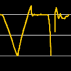

# jiyi.metaの開発ページ
## VocalTuner
[App Storeで見る](https://apps.apple.com/jp/app/vocaltuner/id1505735245)  

### 概要

音の高さを軌跡で確認できるチューナーです。

iPhoneの内蔵マイクで拾った音の高さを、軌跡として画面に表示します。iPhoneに向けて歌ってみると、音の外しやしゃくりなど、一目瞭然です。

#### 基本的な機能
- 上下にスクロールして、任意の音の高さを確認できる。
- 軌跡を記録する速さを設定できる。
- 表示する音の範囲を設定し、無駄なスクロールを避けられる。
- 必要最低入力値を設定し、環境音の大きな場所でも必要な音だけ確認できる。
- 上下方向に拡大/縮小できる。
- 目的の曲に合わせて音階（調）の表示を設定できる。
- キャリブレーション（A4=440Hzや442Hzなど）を設定できる。
- 軌跡を記録し、横にスクロールして復習できる。
- 記録がたまり動作が重くなった場合は、記録を消去して動作を軽くすることができる。

#### アプリ内課金
- 広告を非表示にできる（¥120）。
