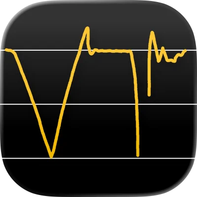
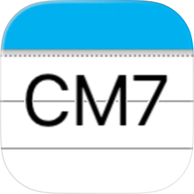
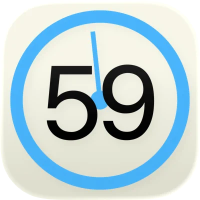

[English](./index.md) | [日本語](./ja.md) | **한국어** | [中文](./zh.md)

# Harmolo

Harmolo(하모로)는 음악과 일상을 조금 더 풍요롭게 하는 앱을 제공합니다.

## Apps

###  VocalTuner

노래의 음정을 실시간 궤적으로 그려, 목소리를 보면서 연습할 수 있는 튜너.

- [iOS: App Store](https://apps.apple.com/us/app/vocaltuner-pitch-training/id1505735245)
- [Web](https://vocal-tuner-36497.web.app/)

###  folino

악보 표시·재생 앱. 악보 정리에도 편리합니다.

- [iOS: App Store](https://apps.apple.com/us/app/folino-score-viewer-player/id6766994527)

###  Chord Memo

코드 진행을 간편하게 메모하고 정리할 수 있는 간단한 앱.

- [iOS: App Store](https://apps.apple.com/us/app/chord-memo/id6446309728)

###  SeClock

초 단위까지 표시하는 시계 위젯.

- [iOS: App Store](https://apps.apple.com/us/app/seclock-seconds-clock-widget/id6445807658)

## 문의

이메일: [jiyi.meta@gmail.com](mailto:jiyi.meta@gmail.com)

## 개인정보 처리방침

- [개인정보 처리방침](./privacy-policy/ko.md)
